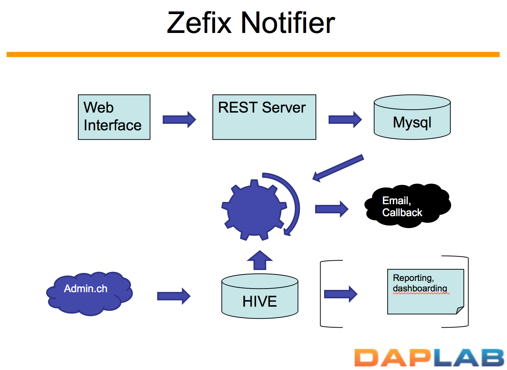

Zefix Notifier
----

This repository stores the material of the so-called project Zefix Notifier.
The project is detailled [here](http://daplab.ch/2015/10/07/daplab-session-1-zefix-notifier-project/), 
including a [deck](http://daplab.ch/wp-content/uploads/2015/10/Zefix.pptx) to illustrate.

In a nutshell, the goal of the project is to ingest the data from 
[Zefix](http://www.e-service.admin.ch/ws-zefix-1.6/ZefixService?wsd
) (Zentraler Firmenindex, _password protected_)-- the Central Business Names Index for Switzerland.

This data will be crawled daily, cleaned and transformed in a usable format and stored in Hive.

A web interface will be provided, which will allow any user to register a keyword, an email address
and optionally a callback URL. The keyword will be then compared every night against the data 
ingested from Zefix, and if it matches, an email will be sent to inform about the match (and optionally 
the URL will be requested).

The project is built as part of the Hacky Thursday, and is then split in iterative sub-tasks, 
hopefully affordable in 3 hours or so.

## Day1: project definition and groundwork

During the first session, we basically defined the project and did groundwork, mostly in the 
query part. All the details are given [here](day1.md).

